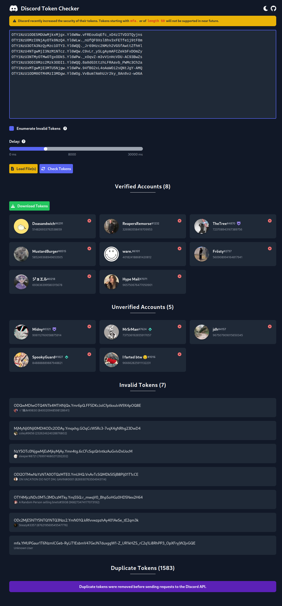

**Disclaimer:** This tool is for educational purposes only. I am not responsible for damages of any kind that are caused by using this tool.

## ❓ Information
This project is an open source tool which allows you to quickly check collected Discord tokens. You can easily export valid tokens and import text files containing tokens. 

## 💻 Features
- Load Discord tokens via files or paste them into the checker
- Automatic removal of duplicated tokens
- Check for verified accounts, including badges and other account information
- Download valid tokens
- Enumerate expired tokens (retrieve username and ID of old tokens)

❗ **Supports new Discord token format**

## 📷 Preview 

## 🔨 How to build and host yourself
This project is built with the [Nuxt3](https://v3.nuxtjs.org) framework and requires Node.js to run.

#### Install dependencies
> npm install
#### Build project
> npm run build
#### Preview build
> npm run preview

To deploy your build please refer to the Nuxt3 [deployment documentation](https://v3.nuxtjs.org/guide/deploy).

